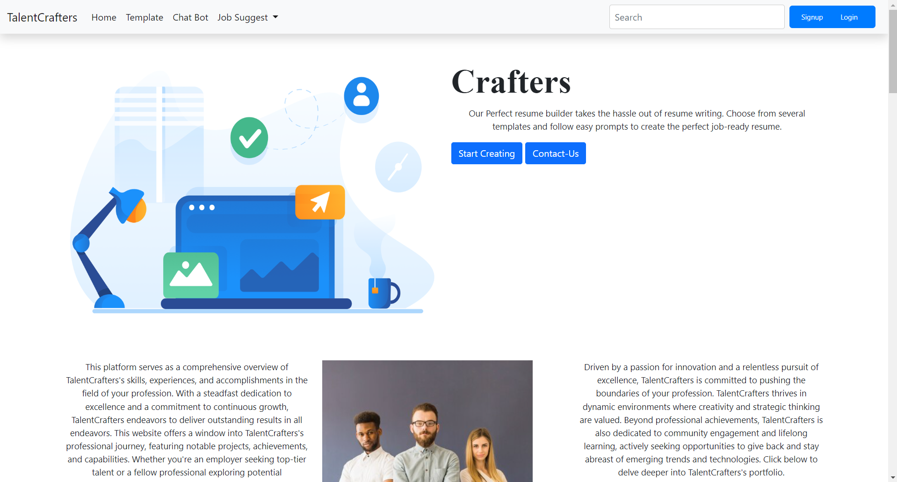

# TalentCrafters - Resume Building Website

Welcome to TalentCrafters, a resume building website designed to help users create professional resumes and explore career opportunities.

## Installation

To run this project locally on your machine, follow these steps:

### 1. Install XAMPP

- **Download XAMPP**: Visit the [Apache Friends website](https://www.apachefriends.org/index.html) and download the XAMPP installer for your operating system (Windows, macOS, or Linux).
- **Install XAMPP**: Follow the installation instructions and ensure that Apache and MySQL are selected components.

### 2. Setting Up the Database

- **Create Database**: In your web browser, open `phpMyAdmin` (typically accessed at `http://localhost/phpmyadmin`) and create a new database named `talentcrafters`.

- **Import SQL Tables**: 
  - Locate `talentcrafters.sql` file provided with this project.
  - In `phpMyAdmin`, select the `talentcrafters` database.
  - Go to the `Import` tab and choose the `talentcrafters.sql` file to import. This will create necessary tables in the database.

### 3. Using Gemini API

- **Gemini API Integration**: TalentCrafters uses the Gemini API for job suggestions and career roadmap features.
  - Obtain API keys from Gemini and replace placeholders in `gemini/response.php` with your API credentials.
  - Refer to Gemini API documentation for details on endpoints and usage.

### 4. Running TalentCrafters

- **Clone the Repository**: Clone this repository to your local machine

- **Move Files**: Move the contents of the cloned repository to the `htdocs` directory within your XAMPP installation directory (e.g., `C:\xampp\htdocs` for Windows).

- **Access TalentCrafters**: Open a web browser and navigate to `http://localhost/talentcrafters` to access TalentCrafters.

## Features

- **Resume Builder**: Create professional resumes using customizable templates.
- **Guest Mode**: Build resumes without creating an account.
- **User Accounts**: Register and login to save and manage resumes.
- **Resume Upload & Parsing**: Upload existing resumes for automatic extraction of details.
- **Chatbot Assistance**: Get real-time support and answers through the chatbot.
- **Career Roadmap & Job Suggestions**: Receive personalized career guidance and job recommendations using the Gemini API.

## Contributors

- [Aayush Kukreja (Backend Developer)](https://github.com/Aayush6377)
- [Anmol Negi (Frontend Developer)](https://github.com/anmolnegi31)
- Kartik Mendiratta (AI Integration Specialist)

## Technologies Used

- HTML/CSS/JavaScript
- PHP
- MySQL
- Bootstrap (for responsive design)
- Gemini API
